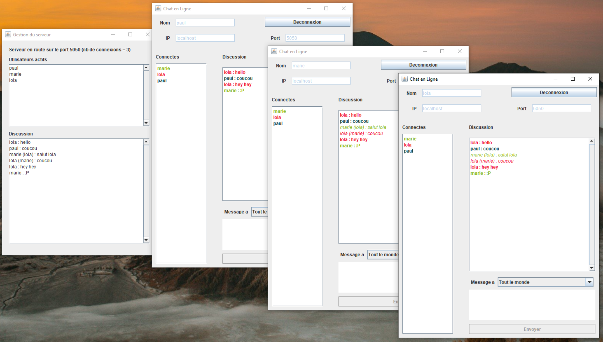

## PROJET - Application de chat instantanné :
Projet réalisé dans le cadre du module "Programmation Orientée Objet et Java" de la 3ème année de Licence Informatique (Le Mans Université).

### Objectifs :

* Réaliser une application client-serveur de chat
* Appliquer les connaissances acquises en Java
* Réaliser une interface graphique
* Utiliser la communication réseau qui a été introduite en cours (threads, socket, multithreading...)

### Fonctionnalités implémentées :

* Couleurs pour différencier les utilisateurs
* Messages en broadcast (tous les clients recoivent le message)
* Messages privés (seulement 1 destinataire que l'expediteur a selectionne)
* Les messages privés sont en italique (les autres sont en gras)
* Possibilité de reconnexion apres une déconnexion dans la meme fenetre

### Démonstration :

### Mode d'emploi :

1. Lancer le serveur => compiler et exécuter : FenetreServeur.java
2. Ouvrir des fenêtres pour les clients => compiler et executer FenetreClient.java
3. Entrer le nom du client, l'adresse ip (localhost) et le port (5050)
4. Se connecter
5. Vous pouvez maintenant discuter :)
